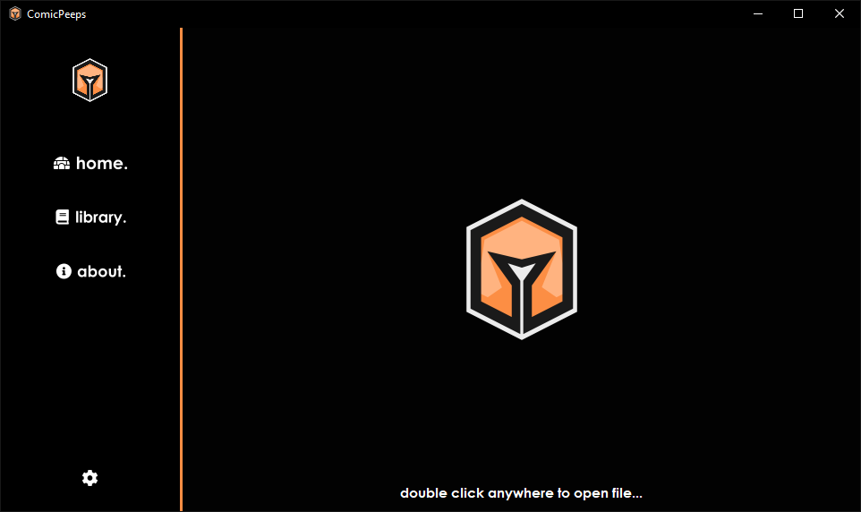
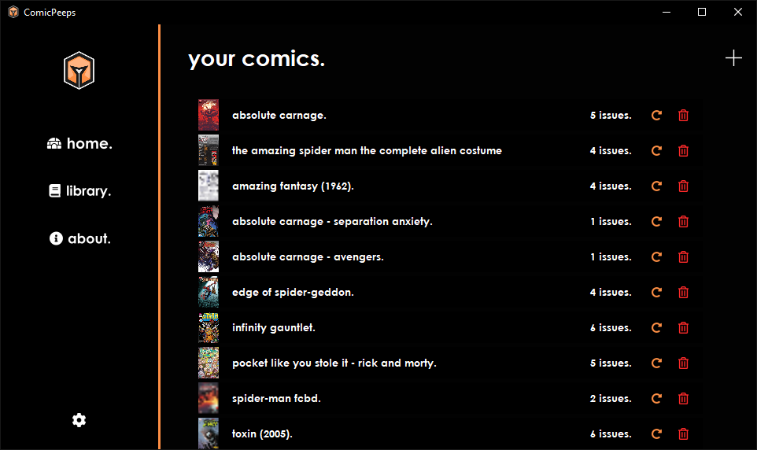
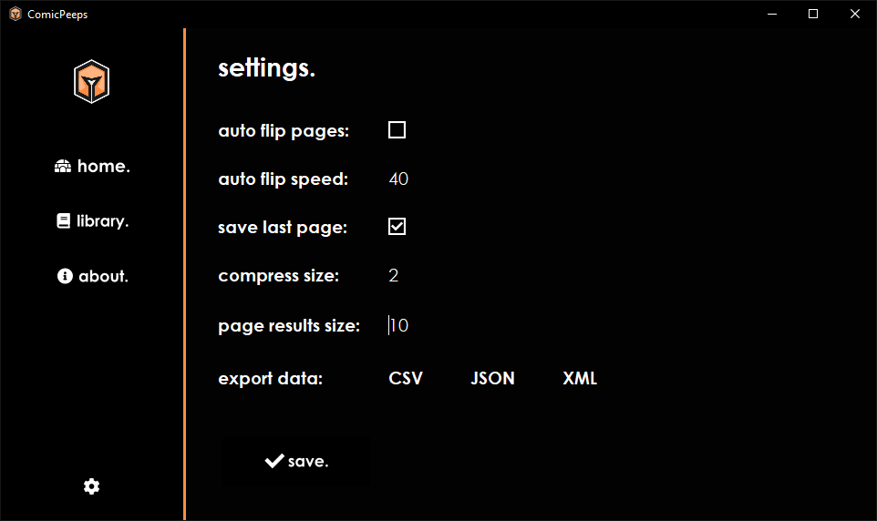
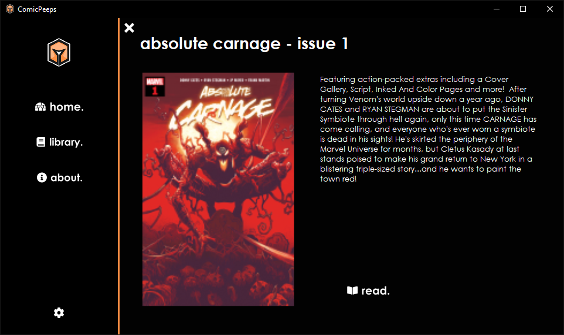
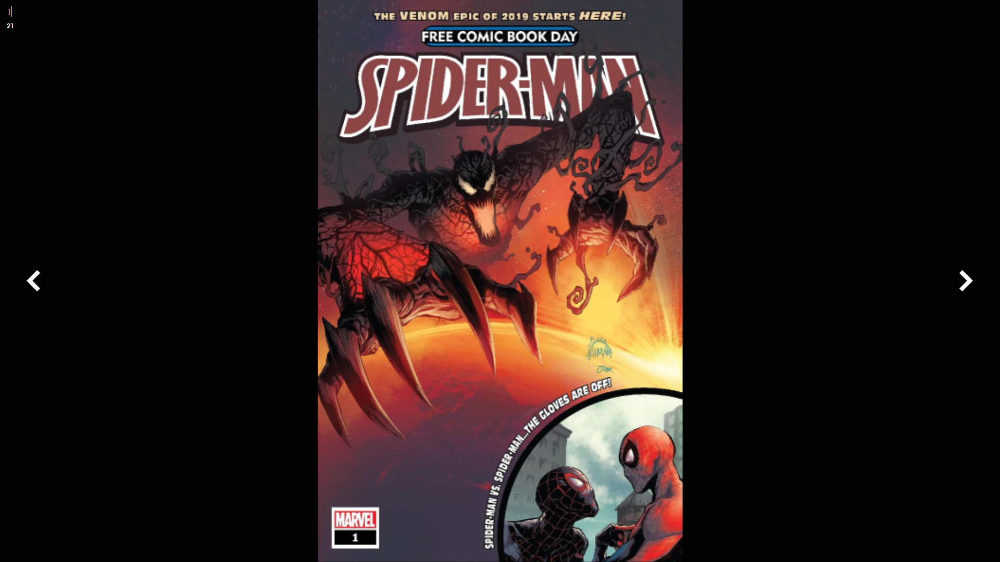

[![GitHub all releases](https://img.shields.io/github/downloads/kitric/comicpeeps/total?logo=data%3Aimage%2Fpng%3Bbase64%2CiVBORw0KGgoAAAANSUhEUgAAADEAAAAxCAYAAABznEEcAAAACXBIWXMAAA7DAAAOwwHHb6hkAAAAGXRFWHRTb2Z0d2FyZQB3d3cuaW5rc2NhcGUub3Jnm%2B48GgAAByRJREFUaIHNWn1MFGceft6Z3dVVPmQHULaystVSpAmUiNGjoF6itUT%2F8A5pa4niRy8RG%2FEinPEvSMCkMdkzEU1ocsYYYxtbbVLbnNHkmmj8iFbFdlpWULQFhGOXGUCgrC7MvPfHsrPssjvM7C7pPQnJ%2Ft55fh8PM%2B%2B77%2FzeBWYRgiBUCoJARVHcNZt5yGwEFQThrwC%2BnpaMkHKO4y7GO19cRYii%2BC6l9KrfLi0tRU9PD6xWK65cuRJISsh7HMddDRskCsRFhCiKRZTSW357y5YtePbs2TSe3W7HpUuXFJthmGKLxXJrGlEnYhLhcrnyWZb90W9v27YNra2tM%2Frl5ubi%2FPnzii3LckF6evqPKi6qiEqE2%2B1%2Bg2GYx357z549uHfvnu44hYWFOH36tGIbjcbs5OTkJ3rj6BIhiuJiSmm3366ursa1a9ci8s1GBs7qHLzV1IaxcTkib%2B3atThx4kSgKEIyOY57rrUuTSJ6e3tTTSZTv98%2BfPgwLl%2B%2BHJFvZAnaD%2BTAwBCANQDSBCZkipzjbfBKNKJfaWkpjh49qtgmkyktKSlJiElEf39%2FIiHkhZ%2FX2NiICxcuROQzBGg%2FsBxzDAQwmsFmrVCuSZ0PAK8HryYoco4%2FgooWbN26FXV1dX6TEkIWcBw3rEsEpXSuKIqjAFgAOHbsGM6cORMxKQHQWp2DBBMDGOaAta%2BMyJV%2BvQdMvMLvXhm5TW1Q0YLKykrU1NT4chAijY2NJWZmZno0iRAEoRvA4ubmZjQ3N6ukAX765E2kmFmANYJ9fZUqN0jMs7uANI6hlxLyTrarcvfu3Yt9%2B%2FYBwPPU1NRMXSLy8vIiBv5hbzYWJRgAxgB26WrNxYdCenoHkCfgGp3Ays8eR%2BTxPA9EEGHQm%2FTGx8uwZIEJIAzYZUV63afB%2Fw9Y%2BPQ2umpz0TnkRcmpDl0xNIs4vuk1%2FGV5MkAI2KVFAInvtotdWgRQiiWTYr559ALV%2F%2B7R5KtZhMXMgiQtBLPwjagLnRGEgF32DmR3ByzmUc1ujK4ciWm664oGevPoEzFvga7g0YKYk3XxdYn4f4VuEaNjHlT963u4X4zFtZD%2BYQ%2F2nfoeI6O%2F6%2FbVvcQmzDMjaXwABYfOKWNvZXJoeL8Iq7MzNMe5%2B6QP9V%2Fdxs9dga3RR3kpSEyYr7ckHSIYVvn4afkKfM7%2FB3Ryz9DaLaLsn98p1xPmGlG3dTUqSpYrY1%2FcbEPDxTsY8XjDhicEOFpeMCWf9tI0M0lCYMVg0l5HZ00ubA5nWO7oy3EcOncDh87d0FxIZ00umPRlgXyJaQCmvx2Gg%2BY5QRK4kAEGFz7MCg7GMLDb7apxsrKywDDBab%2F8YAlAgsfIfIvW0vRM7OBvaNa%2BEqsWz%2FNtQSYhyzIqKirA8zwePnyIdevWAfC99LS0tIDneWzfvh2yHHhBsiWb8KfM%2BWCzCkPSad8R6J7YARVGAL691NTH6siRIygvLwfLsmhqagpyoZSisbExaOzm3yYfIYMJ0SKm7wli8W0oH%2F89J2g8Pz8%2FLD90vP2Az4%2BkvBZLGbGJYLglAIC5BgYfFwbPmZ07dwbZu3YFNwH3rLDAbPSlZ1LV59GMdcTkDShLYd26hWCmPMYtLS3o6uoCAHR3d%2BPBgwcBFwLU%2F3nRpBFYuqMuIdYArD0wIX%2BryQ26tnnzZgDApk2bgsan8tisyK%2ByWhG3O%2BHHtxXqj8al0Ots9GuLUkLMERCYGwDwdoZZlVsw5TqxLI5H%2BthF0KH%2FQhY7o%2FMdeA65%2B6dYS4hNhNRxC3L%2F05gKoC9HID25CciRO4QzQbMIufcX0Bd9vsRjQ77EVK1rpA%2FS09uQ%2Bya7HeMeyD2%2FaPbVNatkdwfg1teJ0AM64oY04tbtp%2FlO9I1M6A4eC%2FpGtefTLOIfV3thczjRJryKqiitaBdeweZwovZKr2Yf3Yv0u2d8E1lposUJXUNeFOtsmvmheif8zdxwKDnVAZvDCZeO2x4OrtEJ2BxOVQEHDx5UjRFWhMfjySaESJWVleB5HlVVVREDrPzsMWwOJwY9ksayfRj0SLA5nKr916qqKvA8799Myh6PJzscT%2FXNQxTFJErpkJ%2FncDhw9uzZiHwCwFmdg%2BVNbcoYz%2FOY2ph%2BVJ0zY0t%2Fx44dqK2t9ZvRnU%2BEYnh4ONXr9SonRQ0NDbh4UdtxdKgINZSVlaG%2Bvl6xx8fH0zMyMvpVXADEeGY307EXoE1E6DEXIcTGcVy3iksQ4nJ6un%2F%2Ffly%2Ffj0sV03EmjVrcPLkScWmlL6ZlpYWeZJEQEz9%2BcHBwXxJkpTz5927d%2BP%2B%2FftBnHAiQo9%2BWZYtSElJifocOy4YGBh4RxAE6v%2FbsGEDtVqt1Gq1UkEQlM%2Fr16%2BnU3lut7v4Dy08HFwu18apRZaUlFBBEGhxcXFQ8aIoboxn3ln5lY0oimWU0mnL12z9ymZWIQjCzsnHZlZ%2F7%2FQ%2FMTCnvTJUSngAAAAASUVORK5CYII%3D&style=for-the-badge)](https://github.com/kitric/comicpeeps/releases/latest)

# ComicPeeps

The Digital Comic Book Reader!  
Part of the [Kitric](https://github.com/kitric) family :smile:

## Features

ComicPeeps has a wide variety of features, such as:
- CBR/CBZ file reading
    - Auto flipping pages
    - Custom image compression size
    - JPEG, JPG, PNG and BMP image support
    - Immersive fullscreen reading
- Library management
    - Library history and page auto bookmarking
    - Metadata reading (editing coming soon!)
    - Built in issue tracking
- Data management
    - Export library data as CSV, JSON (integration), XML (integration)

## Current supported file formats:
- **Comic files**
    - CBR
    - CBZ
- **Comic contents**
    - JPG
    - JPEG
    - PNG
    - BMP

## Upcoming features

A few planned features for future updates:
- PDF reading
- CBZ metadata tagging/editing
- More filetypes
- Store data in a database instead of a single file - should reduce load on the update function

## Downloads

Currently ComicPeeps is only available on Windows, and can be downloaded from the [releases](https://github.com/kitric/comicpeeps/releases/latest) page, or the [website](https://kitric.github.io/projects/comicpeeps/).

## Installation

Installing ComicPeeps is pretty easy, just run the installation file like any other application.

## Screenshots

## Credits

This project would not be possible without the help of: 
- [SharpCompress (adamhathcock)](https://github.com/adamhathcock/sharpcompress)
- [GitHubUpdate (nixxquality)](https://github.com/nixxquality/GitHubUpdate)
- And of course the [Kitric](https://github.com/kitric) team!

Thanks - crxssed :heart:
